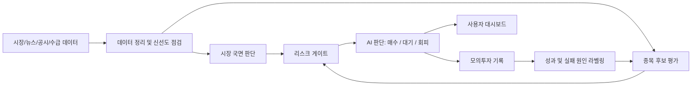

# KIS AI 트레이더

한국 주식 시장 데이터를 기반으로 AI가 모의투자 판단을 보조하고, 사용자가 `왜 매수/대기/차단인지`를 확인할 수 있도록 만든 투자 보조 대시보드 프로젝트입니다.

> 이 저장소는 공개 포트폴리오용입니다. 실제 운영 코드, 인증 정보, 계좌 정보, 서버 접속 정보, 운영 로그, 실거래 설정, 원본 데이터는 포함하지 않습니다.

## 한 줄 요약

AI 자동매매를 바로 실행하는 서비스가 아니라, **모의투자 검증, 판단 근거 설명, 위험 차단, 운영 안정성**을 중심으로 설계한 AI 투자 판단 대시보드입니다.

## 해결하려는 문제

AI 투자/자동매매 서비스에서 가장 위험한 지점은 사용자가 AI의 판단 근거를 모른 채 결과만 보게 되는 것입니다.

이 프로젝트는 다음 질문에 답하도록 설계했습니다.

- 왜 지금 매수하지 않는가?
- 어떤 데이터가 부족한가?
- 어떤 조건이 통과되면 다음 행동을 하는가?
- 현재 상태가 모의투자인가, 실거래 준비 단계인가?
- AI가 너무 보수적인가, 아니면 근거 없이 공격적인가?
- 서버나 엔진이 꺼졌을 때 어떻게 감지하고 복구하는가?

## 주요 기능

| 영역 | 기능 | 설명 |
|---|---|---|
| 요약 화면 | 현재 상태 브리핑 | 모의자산, 손익, AI 결론, 시장 상태, 검증 상태를 한 화면에 표시 |
| 모의투자 | 보유/후보 관리 | 보유 종목, 평가손익, 최근 매수/매도 기록, 추가 매수 보류 이유 표시 |
| AI 판단 | 판단 근거 설명 | 시장 국면, 뉴스, 후보 점수, 리스크, 데이터 신선도, 주문 잠금 상태 표시 |
| 히스토리 | 성과 해석 | 누적 손익과 하루 변화를 분리해 사용자 오해를 줄임 |
| 운영 상태 | 안정성 점검 | 엔진 heartbeat, 데이터 수집, 패널 상태, 로그/디스크 상태를 점검 |
| 안전 전환 | 실거래 분리 | 모의 검증, 실계좌 조회, 관리자 승인, 첫 주문 승인을 단계적으로 분리 |

## 기술 관점

### Backend

- Python 기반 데이터 수집, 판단 루프, 모의투자 기록 구조
- KIS API 연동을 전제로 한 mock-first 설계
- 실주문 잠금 플래그와 kill-switch 개념 적용
- 로그 기반 운영 상태 추적
- 외부 데이터 신선도와 리스크 조건을 판단 흐름에 반영

### Frontend

- 요약, 모의투자, AI 판단, 종목 정보, 히스토리, 운영 화면으로 정보 구조 분리
- 사용자가 수익률을 오해하지 않도록 누적 손익과 당일 변동을 분리
- 상세형 화면과 간편형 화면을 나눠 초보 사용자와 관리자 모두를 고려
- AI의 결론보다 `왜 그런 판단을 했는지`를 먼저 보여주는 UX 설계

### Operations

- 엔진이 꺼지지 않는 것을 목표로 하기보다, 꺼졌을 때 감지하고 복구하는 구조로 설계
- heartbeat 기반 상태 확인
- watchdog, 주기 리포트, 알림, 로그 pruning 개념 적용
- 오라클 서버 재시작/패널 재시작 상황을 고려한 운영 체크리스트 작성
- 휴장일/주말 손익 기록을 만들지 않는 히스토리 진실성 원칙 적용
- 종목별 차트/뉴스 최신성 점검으로 특정 종목 데이터 누락 감지
- KIS/Yahoo/뉴스/공시/보강 데이터의 출처를 구분해 표시하는 원칙 적용
- read-only 공개 화면과 관리자 화면을 분리해, 일반 조회는 쉽게 접근하되 관리 기능은 별도 보호
- 감사 로그 외부 백업과 heartbeat 실패 감지 시뮬레이션으로 운영 증적 보존 흐름 정리

## 시스템 흐름

## AI 운용 원칙

- 근거 없이 매수하지 않기
- 조건을 통과한 후보를 계속 방치하지 않기
- 장이 열리지 않으면 신규 매수하지 않기
- 뉴스, 시장 상태, 보유 비중, 리스크를 함께 보기
- 목표 비중은 즉시 매수 명령이 아니라 최대 운용 기준으로 사용하기
- 실거래 주문은 별도 승인 전까지 잠금 상태로 유지하기

## 수익성 행동균형

이 프로젝트의 핵심은 단순히 매수 신호를 많이 만드는 것이 아닙니다.

AI가 너무 보수적이면 좋은 후보를 계속 놓치고, 반대로 너무 공격적이면 근거 없는 손실을 만들 수 있습니다. 그래서 아래 데이터를 함께 보도록 설계했습니다.

- 시장 국면
- 공시/시장경보
- 호가/체결 품질
- 유동성/거래비용
- 해외장 선행 데이터
- 후보 사후 수익률
- 수수료와 세금 차감 후 성과

자세한 내용은 [수익성 행동균형 설계](docs/수익성_행동균형_설계.md)를 참고하세요.

## 운영 안정화 설계

실제 운영에서는 “절대 안 꺼짐”보다 “꺼졌을 때 빠르게 감지하고 복구함”이 더 현실적인 목표입니다.

이 프로젝트에서는 다음 관점으로 운영 안정성을 정리했습니다.

- 프로세스 자동 재시작
- heartbeat 상태 확인
- watchdog 기반 복구
- 로그 용량 제한
- 오라클 서버 재시작 대비
- 알림/리포트 자동화
- 휴장일 히스토리 진실성 점검
- 차트/뉴스 데이터 최신성 점검
- 데이터 출처 메타데이터 점검
- 장중 평가와 마감 확정 기록 분리
- 전체 운영 체크리스트 결과를 JSON/Markdown 리포트로 남기는 자동 점검 흐름
- 감사 로그 백업 목적지 점검과 자동 백업 예약
- 실제 운영 증적이 부족한 항목은 완료로 표시하지 않고 확인 필요로 분리

자세한 내용은 [운영 안정화 설계](docs/운영_안정화_설계.md)를 참고하세요.

## 공개 범위

| 구분 | 공개 여부 | 이유 |
|---|---:|---|
| 프로젝트 개요 | 공개 | 포트폴리오 이해에 필요 |
| 화면/UX 설계 | 공개 | 사용자 문제 해결 방식 설명 가능 |
| AI 판단 구조 | 공개 | 핵심 설계 역량 설명 가능 |
| 운영 안정화 체크리스트 | 공개 | 운영 관점의 문제 해결 과정 설명 가능 |
| 실제 코드 | 비공개 | 실거래/인증/운영 로직 포함 가능 |
| 인증 정보 | 비공개 | 보안 위험 |
| 계좌/서버/로그 | 비공개 | 개인정보와 운영 보안 위험 |
| 원본 데이터 | 비공개 | 라이선스/개인 운영 정보 가능성 |

## 데모 링크

현재 운영 중인 링크는 인증, 운영 상태, 내부 설정 노출 가능성이 있어 공개 README에는 직접 넣지 않았습니다.

면접이나 포트폴리오 검토 상황에서는 별도 read-only 데모 또는 캡처 자료 형태로 제공하는 것을 권장합니다.

## 문서

- [프로젝트 요약](docs/프로젝트_요약.md)
- [아키텍처 요약](docs/아키텍처_요약.md)
- [수익성 행동균형 설계](docs/수익성_행동균형_설계.md)
- [운영 안정화 설계](docs/운영_안정화_설계.md)
- [UI/UX 개선 방향](docs/UI_UX_개선_방향.md)
- [AI 활용 정리](docs/AI_활용_정리.md)
- [API 명세 요약](docs/API_명세_요약.md)
- [트러블슈팅](docs/트러블슈팅.md)
- [면접 설명 정리](docs/면접_설명_정리.md)
- [기술 면접 꼬리질문](docs/기술_면접_꼬리질문.md)
- [발표 스크립트](docs/발표_스크립트.md)
- [이력서 프로젝트 요약](docs/이력서_프로젝트_요약.md)
- [정기 운영 체크리스트](docs/정기_운영_체크리스트.md)
- [공개 범위](docs/공개_범위.md)
- [포트폴리오 공개 체크리스트](docs/포트폴리오_공개_체크리스트.md)
- [포트폴리오 PDF](portfolio/KIS_AI_Trader_Portfolio.pdf)

## 프로젝트에서 배운 점

이 프로젝트를 하면서 가장 크게 느낀 점은 “기능이 많아도 사용자가 이해하지 못하면 좋은 서비스가 아니다”라는 점입니다.

그래서 단순히 자동매매 기능을 늘리는 것보다, 사용자가 지금 무엇을 봐야 하는지, AI가 왜 기다리는지, 어떤 조건이 충족되지 않았는지를 더 직관적으로 보여주는 방향으로 개선했습니다.

또한 실거래가 가능한 도메인에서는 기능 구현보다 안전장치, 검증 기간, 공개 범위, 운영 복구 체계가 훨씬 중요하다는 점을 정리할 수 있었습니다.
