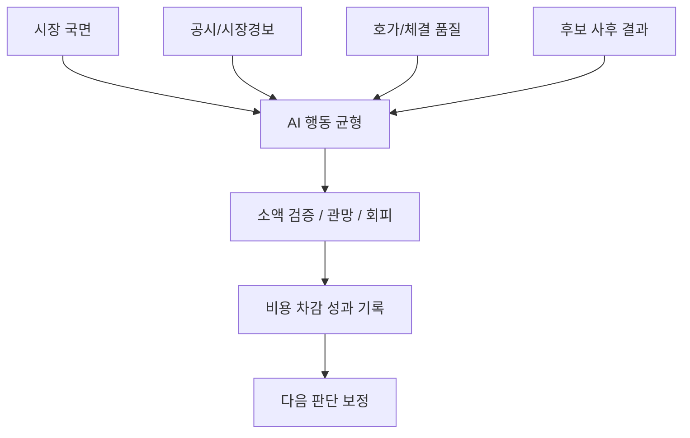

# 수익성 행동균형 설계

## 결론

이 프로젝트의 AI 운용 목표는 단순히 매수 신호를 많이 내는 것이 아닙니다.

핵심은 두 가지를 동시에 막는 것입니다.

- 너무 보수적이라 좋은 후보를 계속 놓치는 문제
- 근거 없이 과감하게 매수해서 손실을 키우는 문제

그래서 AI 판단을 `매수/관망/회피` 하나로 끝내지 않고, 시장 국면, 공시 리스크, 호가 품질, 비용 차감 성과, 후보 사후 결과를 함께 보도록 설계했습니다.

## 판단 구조



## 추가한 데이터 관점

| 데이터 | 목적 |
|---|---|
| 공시/시장경보 | 거래정지, 관리종목, 투자주의 같은 신규 매수 차단 조건 |
| 호가/체결강도 | 실제 진입 가능한 가격인지, 스프레드가 넓지 않은지 확인 |
| 공매도/대차 압력 | 좋아 보이지만 계속 눌리는 종목을 피하기 위한 참고값 |
| 해외장 선행 데이터 | 미국 지수/선물, 변동성, 신용, 환율, 금리, 원자재, 아시아 흐름 반영 |
| 미국 섹터/ETF 흐름 | 반도체, AI 서버, 빅테크, 배터리, 금융, 에너지, 산업재, 바이오, 로봇/AI 선행 흐름 반영 |
| 장중/VWAP·갭 데이터 | 추격 매수, 갭 붕괴, 거래대금 급감 구간 구분 |
| 유동성/거래비용 | 예측은 맞아도 스프레드와 체결 비용으로 손실 나는 종목 감속 |
| 테마 대장주/후발주 관계 | 테마 안에서 실제 돈이 몰리는 종목을 우선 |
| 수급 연속성 | 하루짜리 외국인/기관 매수와 연속 매수 구분 |
| 실적/물량/개인 과열 프록시 | 이벤트 리스크, 보호예수/CB/BW성 물량 부담, 과열 심리 감속 |
| 검색/커뮤니티 프록시 | 대중 관심 확산과 과열 위험을 분리해서 반영 |
| 신용/보호예수/컨센서스 입력 슬롯 | 공식 또는 라이선스 원천이 들어오면 바로 학습에 반영 |
| 전략/매도 품질 | 어떤 전략이 실제로 돈을 벌었고 매도가 적절했는지 기록 |
| 시장 국면 | 강세장/약세장/패닉장에 따라 매수 강도 조절 |
| 후보 사후 라벨 | 안 산 종목이 이후 올랐는지도 기록 |
| 체결 품질 | 수수료와 세금 차감 후 실제 수익성 평가 |

## 너무 보수적인 AI 방지

AI가 모든 후보를 `관망` 또는 `회피`로만 두면 수익 기회를 놓칠 수 있습니다.

그래서 시장이 완전한 패닉이 아니고 상위 후보가 있으면, 최소한 Paper 모드에서 소액 검증 후보를 남기도록 설계했습니다.

예시:

- 약세장: 강한 후보만 소액 검증
- 횡보장: 상위 후보 1개 이상 관찰/검증
- 건설적 시장: 조건 통과 후보를 계속 방치하지 않음
- 강세장: 표준 비중까지 허용하되 단일 테마 집중 제한

## 막 매수하는 AI 방지

아래 조건에서는 신규 매수를 줄이거나 막습니다.

- 고위험 공시
- 거래정지/관리종목/시장경보
- 시장 패닉
- 스프레드 확대
- 체결강도 약화
- 공매도 압력 증가
- 비용 차감 후 최근 성과 악화
- 데이터 신선도 문제

## 수익 라벨 기준

수익성 평가는 단순 가격 상승률이 아니라 비용 차감 후 기준으로 봅니다.

```text
순수익률 = 가격수익률 - 매수수수료 - 매도수수료 - 거래세
```

이렇게 해야 예측은 맞았지만 실제로는 수수료와 슬리피지 때문에 손실이 나는 케이스를 구분할 수 있습니다.

## 추가 수익성 입력 레이어

AI 판단에는 별도 `profitability_control` 관점도 둡니다. 이 관점은 매수 신호를 무작정 늘리는 용도가 아니라, 아래 두 방향을 동시에 수행합니다.

| 방향 | 예시 |
|---|---|
| 후보 보강 | 강한 테마, 대장주 위치, 갭 유지, 놓친 기회가 많았던 구간 |
| 후보 감속 | 유동성 비용, 갭 반전 위험, 물량 부담, 개인 과열, 약한 매도 품질 |

즉 “안 사는 AI”와 “막 사는 AI” 사이에서 기대값이 있는 후보만 더 적극적으로 보고, 위험한 후보는 더 강하게 걸러내는 구조입니다.

공식 원천이 필요한 데이터는 추측으로 채우지 않습니다. 신용융자, 보호예수/CB/BW, 컨센서스/실적 일정은 별도 입력 슬롯을 두고, 검증된 데이터가 없으면 중립값과 `needs_data` 상태로 남깁니다.

## 해외장 선행 학습 레이어

한국장은 미국장과 아시아장 영향을 크게 받기 때문에 `global_lead` 관점도 별도로 둡니다.

공개용 설명 기준으로는 아래 데이터를 날짜별로 저장해 국내 종목별 영향 점수로 바꿉니다.

| 구분 | 예시 | 목적 |
|---|---|---|
| 미국 지수/선물 | QQQ, SPY, NASDAQ, S&P500, NASDAQ Futures | 다음 한국장 위험선호 판단 |
| 변동성/신용 | VIX, VVIX, MOVE, HYG, LQD | 시장이 위험회피인지 확인 |
| 반도체/AI 칩 | SOXX, SMH, NVIDIA, AMD, Micron, TSMC, ASML | 삼성전자, SK하이닉스, HBM/장비주 선행 신호 |
| AI 서버/클라우드 | SMCI, MRVL, Microsoft, Amazon, Google, Oracle | AI 인프라 투자심리 확인 |
| 빅테크/성장주 | Apple, Microsoft, Alphabet, Meta, Amazon, Tesla | 국내 성장주/플랫폼주 심리 보정 |
| 2차전지/전기차 | Tesla, LIT, DRIV | 배터리 밸류체인 보정 |
| 금리/환율 | 미국 10년물, TLT, USD/KRW, DXY, USD/CNY | 외국인 수급과 성장주 할인율 부담 |
| 원자재 | WTI, Brent, 천연가스, 금, 은, 구리 | 화학, 소재, 운송, 경기민감주 영향 |
| 중국/대만/아시아 | 항셍, 항셍테크, 상하이, 대만, TSMC, 닛케이 | 한국 주변 시장과 반도체 공급망 영향 |

이 레이어도 매수 신호를 무조건 키우는 용도가 아닙니다. 해외장 점수는 작은 가산/감산으로만 쓰고, 공시 리스크, 유동성 부족, 비용 차감 성과 악화 같은 안전 조건이 더 우선합니다.

## 포트폴리오 공개 기준

이 문서는 설계 의도와 판단 구조만 공개합니다.

공개하지 않는 것:

- 실제 API 키
- 계좌 정보
- 서버 접속 정보
- 운영 로그 원본
- 실제 주문 코드
- 내부 데이터 원본

## 배운 점

투자 AI에서 중요한 것은 “맞춘다/틀린다”만이 아니었습니다.

실제로는 다음 질문이 더 중요했습니다.

- 언제 쉬어야 하는가?
- 조건이 괜찮은데 너무 겁먹고 있지는 않은가?
- 예측 수익이 비용보다 큰가?
- 안 산 후보가 이후 크게 오르지는 않았는가?
- 매수 판단과 체결 품질을 분리해서 보고 있는가?

이 구조를 통해 AI가 더 설명 가능하고, 검증 가능한 방식으로 성장하도록 만들었습니다.
