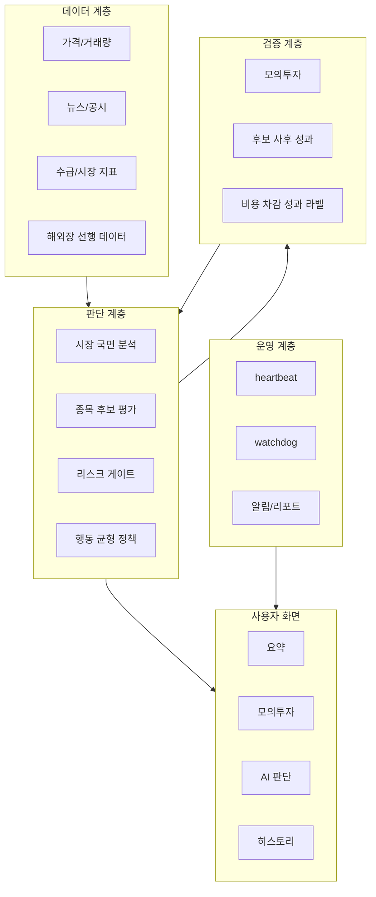

# 아키텍처 요약

## 결론

KIS AI 트레이더는 단순 자동매매 스크립트가 아니라, 데이터 수집, 판단, 리스크 차단, 모의투자 기록, 사용자 설명, 운영 감시를 분리한 구조로 설계했습니다.

공개 저장소에서는 실제 코드를 제외하고 아키텍처 관점만 요약합니다.

## 전체 구조

## 백엔드 설계 포인트

| 포인트 | 설명 |
|---|---|
| mock-first | 처음부터 실거래가 아니라 모의투자 검증을 기본값으로 둠 |
| risk gate | 신규 매수 전 시장/종목/데이터 리스크를 먼저 확인 |
| paper label | 매수 여부뿐 아니라 안 산 후보의 이후 결과도 기록 |
| safety flag | 실주문 가능 상태와 조회 가능 상태를 분리 |
| operational log | 판단 결과와 시스템 상태를 구조화해 저장 |

## 프론트엔드 설계 포인트

| 포인트 | 설명 |
|---|---|
| 요약 우선 | 처음 보는 사용자가 현재 상태를 빠르게 이해하도록 구성 |
| 근거 표시 | AI 결론보다 판단 이유를 함께 표시 |
| 오해 방지 | 누적 손익과 당일 변화를 분리 |
| 상세/간편 분리 | 관리자와 일반 사용자의 정보량을 다르게 설계 |
| 안전 상태 표시 | 실주문 잠금, 검증 기간, 데이터 상태를 명확히 표시 |

## 운영 설계 포인트

| 포인트 | 설명 |
|---|---|
| heartbeat | 판단 루프가 실제로 돌고 있는지 확인 |
| watchdog | 멈춤 감지 후 자동 복구 |
| log pruning | 장기 실행 중 로그 용량 폭주 방지 |
| restart checklist | 서버 재시작 후 복구 항목 문서화 |
| alert/report | 장애와 복구 결과를 남김 |

## 공개하지 않는 부분

- 실제 API 연동 코드
- 실제 주문 실행 코드
- 서버 접속 정보
- 계좌 정보
- 운영 로그
- 원본 학습 데이터
- 인증/알림 비밀값
