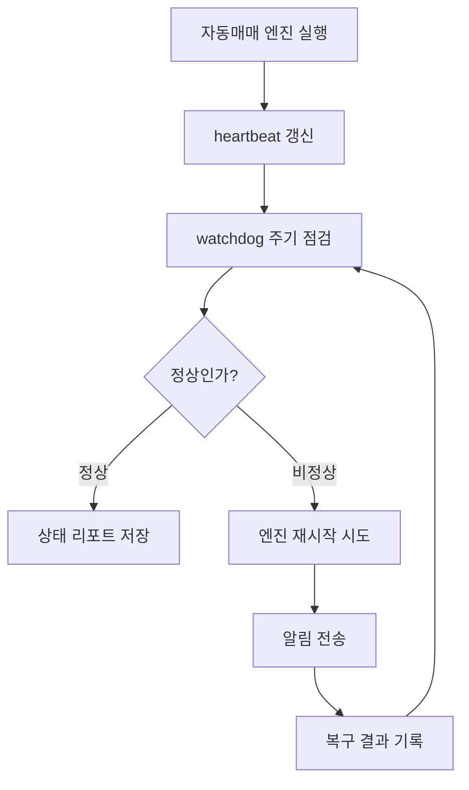

# 운영 안정화 설계

## 결론

이 프로젝트에서 운영 안정성의 목표는 “프로세스가 절대 죽지 않는다”가 아니라, **죽었을 때 빠르게 감지하고 자동으로 복구하며, 사용자가 상태를 확인할 수 있게 만드는 것**입니다.

투자 보조 서비스에서는 판단 정확도만큼이나 다음 요소가 중요합니다.

- 엔진이 멈췄는지 확인할 수 있는가?
- 서버 재시작 후 자동 복구되는가?
- 로그가 쌓여 서버 용량을 압박하지 않는가?
- 실거래 주문은 안전하게 잠겨 있는가?
- 문제가 생겼을 때 알림과 리포트가 남는가?

## 운영 안정화 체크리스트

| 영역 | 설계 내용 | 목적 |
|---|---|---|
| 프로세스 생존 | 자동 재시작 구조 | 엔진 비정상 종료 대응 |
| heartbeat | 최근 루프 실행 시각 기록 | 엔진이 살아 있지만 멈춘 상태 감지 |
| watchdog | 주기적 헬스체크와 복구 | 운영자가 보지 않아도 문제 감지 |
| 중복 실행 방지 | lock 기반 단일 실행 | 같은 엔진이 여러 번 떠서 중복 판단하는 문제 방지 |
| 로그 관리 | runtime log pruning | 장기 운영 중 디스크 용량 증가 방지 |
| 서버 복구 | 재시작 후 패널/타이머/프록시 확인 | 오라클 서버 재부팅 상황 대비 |
| 알림 | 실패/복구 이벤트 알림 | 운영자가 늦게 알아차리는 문제 방지 |
| 리포트 | 상태 점검 결과 파일화 | 사후 분석과 포트폴리오 문서화 |

## 장애 대응 흐름

## 오라클 서버 재시작 대비

오라클 서버는 운영 패널과 데이터 동기화 역할을 담당한다고 가정했습니다. 서버가 재시작되면 다음 항목을 확인해야 합니다.

- read-only 패널 서비스가 다시 올라왔는지
- reverse proxy가 정상인지
- 뉴스/데이터 수집 타이머가 살아 있는지
- 패널 프로세스가 중복 실행되지 않는지
- 디스크 사용률이 위험 수준이 아닌지
- 실거래 서비스가 의도치 않게 켜지지 않았는지

## 실거래 보호 원칙

실거래 전환은 운영 안정화와 별개의 승인 단계로 분리합니다.

공개 포트폴리오에서는 실거래 주문 코드, 인증 정보, 서버 접속 정보는 공개하지 않습니다.

## 배운 점

운영 안정성은 단순히 서버를 켜두는 문제가 아니었습니다.

특히 투자/자동매매 성격의 프로젝트에서는 다음 관점이 필요했습니다.

- 서버가 켜져 있어도 실제 판단 루프가 멈췄을 수 있다.
- 웹 화면이 보여도 systemd나 프로세스 관리 기준으로는 실패 상태일 수 있다.
- 로그와 데이터 파일이 장기적으로 쌓이면 서비스 장애 원인이 될 수 있다.
- 실거래 플래그는 기능 구현보다 더 엄격하게 관리해야 한다.
- 장애를 고친 기록도 포트폴리오에서 중요한 문제 해결 경험이 된다.
