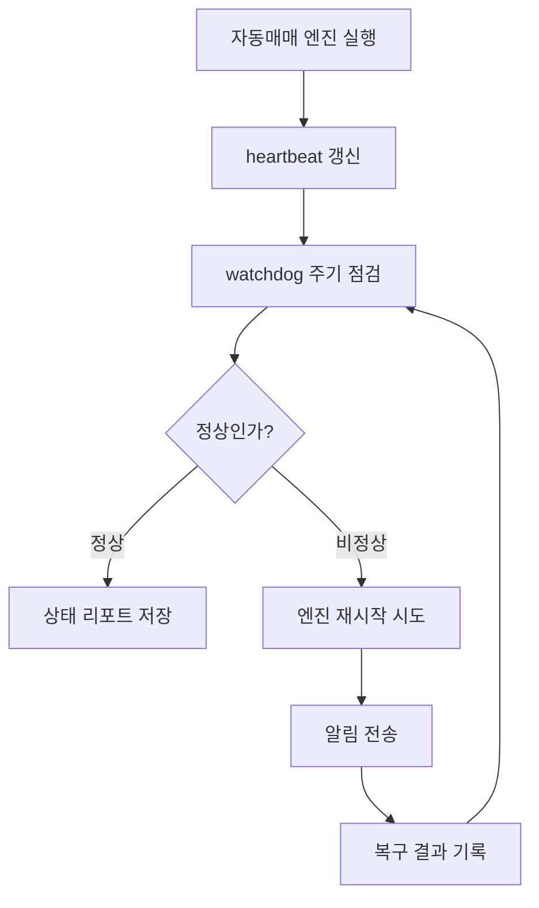

# 운영 안정화 설계

## 결론

이 프로젝트에서 운영 안정성의 목표는 “프로세스가 절대 죽지 않는다”가 아니라, **죽었을 때 빠르게 감지하고 자동으로 복구하며, 사용자가 상태를 확인할 수 있게 만드는 것**입니다.

투자 보조 서비스에서는 판단 정확도만큼이나 다음 요소가 중요합니다.

- 엔진이 멈췄는지 확인할 수 있는가?
- 서버 재시작 후 자동 복구되는가?
- 로그가 쌓여 서버 용량을 압박하지 않는가?
- 실거래 주문은 안전하게 잠겨 있는가?
- 문제가 생겼을 때 알림과 리포트가 남는가?

## 운영 안정화 체크리스트

| 영역 | 설계 내용 | 목적 |
|---|---|---|
| 프로세스 생존 | 자동 재시작 구조 | 엔진 비정상 종료 대응 |
| heartbeat | 최근 루프 실행 시각 기록 | 엔진이 살아 있지만 멈춘 상태 감지 |
| watchdog | 주기적 헬스체크와 복구 | 운영자가 보지 않아도 문제 감지 |
| 중복 실행 방지 | lock 기반 단일 실행 | 같은 엔진이 여러 번 떠서 중복 판단하는 문제 방지 |
| 로그 관리 | runtime log pruning | 장기 운영 중 디스크 용량 증가 방지 |
| 서버 복구 | 재시작 후 패널/타이머/프록시 확인 | 오라클 서버 재부팅 상황 대비 |
| 알림 | 실패/복구 이벤트 알림 | 운영자가 늦게 알아차리는 문제 방지 |
| 리포트 | 상태 점검 결과 파일화 | 사후 분석과 포트폴리오 문서화 |

## 장애 대응 흐름

## 오라클 서버 재시작 대비

오라클 서버는 운영 패널과 데이터 동기화 역할을 담당한다고 가정했습니다. 서버가 재시작되면 다음 항목을 확인해야 합니다.

- read-only 패널 서비스가 다시 올라왔는지
- reverse proxy가 정상인지
- 뉴스/데이터 수집 타이머가 살아 있는지
- 패널 프로세스가 중복 실행되지 않는지
- 디스크 사용률이 위험 수준이 아닌지
- 실거래 서비스가 의도치 않게 켜지지 않았는지

## 운영 안전 점검 자동화

실제 운영에서는 단순히 패널이 보이는지만 확인하면 부족합니다. 그래서 별도 운영 점검 루프를 두어 아래 항목을 주기적으로 검증하도록 설계했습니다.

| 점검 항목 | 목적 |
|---|---|
| 엔진 heartbeat | AI 판단 루프가 멈췄는지 감지 |
| 휴장일 히스토리 | 장이 없는 날에 거짓 손익 기록이 생기는 문제 방지 |
| 차트 데이터 최신성 | 특정 종목만 그래프가 비거나 오래된 가격으로 보이는 문제 감지 |
| 뉴스 데이터 최신성 | AI 판단 근거가 오래된 뉴스에 묶이는 문제 방지 |
| 데이터 출처 메타데이터 | KIS, Yahoo fallback, 뉴스, 공시, 보강값이 섞여도 사용자가 구분 가능 |
| 수익성 입력 커버리지 | 수급, 유동성, 호가, 해외장, 후보 사후라벨이 비어 있는지 감지 |
| 외부 키/권한 상태 | DART, 알림 채널, 증권사 API 권한처럼 운영자가 직접 설정해야 하는 항목 분리 |
| 서버 서비스 상태 | 패널, 프록시, 수집 타이머 자동 복구 확인 |
| 디스크 사용률 | 로그/데이터 누적으로 서버가 멈추는 문제 예방 |
| 재부팅 감지 | 오라클 서버 재시작 이후 자동 복구 여부 확인 |
| 통합 점검 리포트 | 자동 확인, 수동 증적, 외부 데이터 필요 항목을 구분해 기록 |

이 점검은 포트폴리오 공개 저장소에는 코드로 포함하지 않고, 설계와 운영 관점만 문서화합니다. 실제 운영 스크립트에는 서버 경로, 알림 설정, 내부 로그 구조가 포함될 수 있기 때문입니다.

## 최근 운영 점검 요약

공개 가능한 수준으로 요약하면, 운영 점검은 다음 상태까지 확인했습니다.

| 항목 | 상태 | 공개용 설명 |
|---|---:|---|
| 서비스 자동 복구 | 확인 | 서버 재시작 이후 패널, 프록시, 주기 수집 타이머가 복구되는지 점검 |
| read-only 조회 화면 | 확인 | 일반 조회 화면은 접근성을 높이고, 관리자 기능은 별도 보호 |
| 히스토리 진실성 | 확인 | 휴장일/주말에는 새 손익 기록을 만들지 않고 직전 거래일 기준으로 표시 |
| 종목별 차트/뉴스 누락 | 확인 | 특정 종목의 그래프나 뉴스가 빠지는 상황을 점검 항목으로 분리 |
| 데이터 출처 표시 | 확인 | KIS, fallback, 뉴스, 보강값을 구분해 오해를 줄이는 방향으로 정리 |
| 알림 테스트 | 확인 | 운영 알림 채널이 설정된 경우 테스트 알림으로 수신 가능성 확인 |
| 통합 점검 리포트 | 확인 | 실패, 확인 필요, 외부 데이터 필요 항목을 분리해 기록 |
| DART 공시 자동화 | 외부 설정 필요 | API 키가 있어야 실제 공시 row 수집까지 완료 |
| 공매도/대차 데이터 | 외부 원천 필요 | 증권사/공식 데이터 권한 또는 운영 CSV 원천 확정 필요 |
| 실거래 전환 | 미완료 유지 | 모의 검증, 수동 승인, 키 회전, 외부 감사 백업 증적 전까지 실주문 잠금 |

여기서 중요한 점은 “모든 항목을 완료처럼 보이게 하지 않는 것”입니다. 외부 API 키나 실제 데이터 원천이 필요한 항목은 완료로 표시하지 않고, 운영자가 다음에 무엇을 넣어야 하는지 분리합니다.

## 히스토리 진실성 원칙

손익 히스토리는 사용자 신뢰와 직접 연결되므로 임의 추정값을 만들지 않습니다.

- 휴장일과 주말에는 새 손익 기록을 만들지 않습니다.
- 휴장일을 선택하면 직전 거래일 기록을 보여주되, “휴장이라 새 기록 없음”을 명확히 표시합니다.
- 누적 총손익과 하루 변화를 분리해 표시합니다.
- 보강 데이터와 실제 원장 데이터는 source 라벨로 구분합니다.
- 장중 현재 평가는 마감 확정 기록처럼 보이지 않게 표시합니다.

## 데이터 출처 표시 원칙

AI 투자 판단은 데이터가 섞일수록 설명 가능성이 중요합니다. 그래서 공개 포트폴리오에서는 실제 운영 코드를 공개하지 않더라도 아래 원칙을 문서화합니다.

| 데이터 | 표시 원칙 |
|---|---|
| KIS 시세/일봉 | 국내 주식 판단의 기본 원천으로 표시 |
| Yahoo fallback | KIS 수집 실패 시 대체값으로 표시하고 정상 원천처럼 숨기지 않음 |
| Google/네이버 뉴스 | 뉴스/테마 근거로 사용하되 공시와 구분 |
| DART 공시 | 공시 API가 연결된 경우 이벤트 리스크로 별도 표시 |
| 리포트 보강값 | 원장 기록이 없을 때 보강한 값임을 표시 |
| 장중 평가 | `미확정` 상태로 표시하고 마감 기록과 분리 |

추가로 수익성을 높이려면 아래 데이터가 더 필요합니다.

| 상태 | 데이터 | 공개용 설명 |
|---|---|---|
| 적용 | 행 단위 가격 source와 fallback reason | KIS 원천값과 대체값을 구분해 히스토리 신뢰성 확보 |
| 적용 | 장중 평가와 마감 확정 평가 분리 | 장중 숫자를 마감 손익처럼 보이지 않게 처리 |
| 적용 | 외국인·기관·프로그램 수급 | 연속 순매수 흐름을 후보 점수와 보유 판단에 반영 |
| 적용 | 거래대금 급증률과 유동성 품질 | 뉴스는 좋지만 거래가 약한 종목을 감속 |
| 적용 | 섹터/테마 동반 상승률 | 단일 종목 이슈보다 테마 전체 강도를 확인 |
| 적용 | 해외장/환율/반도체 선행 데이터 | 한국장 시작 전 위험선호와 업종 영향을 반영 |
| 적용 | 호가 스프레드와 체결강도 | 실제 주문 비용과 진입 품질을 분리 |
| 적용 | 후보 사후라벨과 체결품질 | 안 산 후보, 산 후보, 비용 차감 성과를 학습 |
| 외부 설정 필요 | DART 공시/실적 이벤트 | API 키 설정 후 자동 공시 리스크로 강화 |
| 외부 설정 필요 | 공매도/대차잔고 | 증권사/공식 데이터 권한 확인 후 연결 |
| 추가 개선 | 5분/30분 진입 성과 | 장중 분봉 또는 체결 snapshot feed 연결 후 라벨링 |

## 실거래 보호 원칙

실거래 전환은 운영 안정화와 별개의 승인 단계로 분리합니다.

공개 포트폴리오에서는 실거래 주문 코드, 인증 정보, 서버 접속 정보는 공개하지 않습니다.

## 배운 점

운영 안정성은 단순히 서버를 켜두는 문제가 아니었습니다.

특히 투자/자동매매 성격의 프로젝트에서는 다음 관점이 필요했습니다.

- 서버가 켜져 있어도 실제 판단 루프가 멈췄을 수 있다.
- 웹 화면이 보여도 systemd나 프로세스 관리 기준으로는 실패 상태일 수 있다.
- 로그와 데이터 파일이 장기적으로 쌓이면 서비스 장애 원인이 될 수 있다.
- 실거래 플래그는 기능 구현보다 더 엄격하게 관리해야 한다.
- 장애를 고친 기록도 포트폴리오에서 중요한 문제 해결 경험이 된다.
